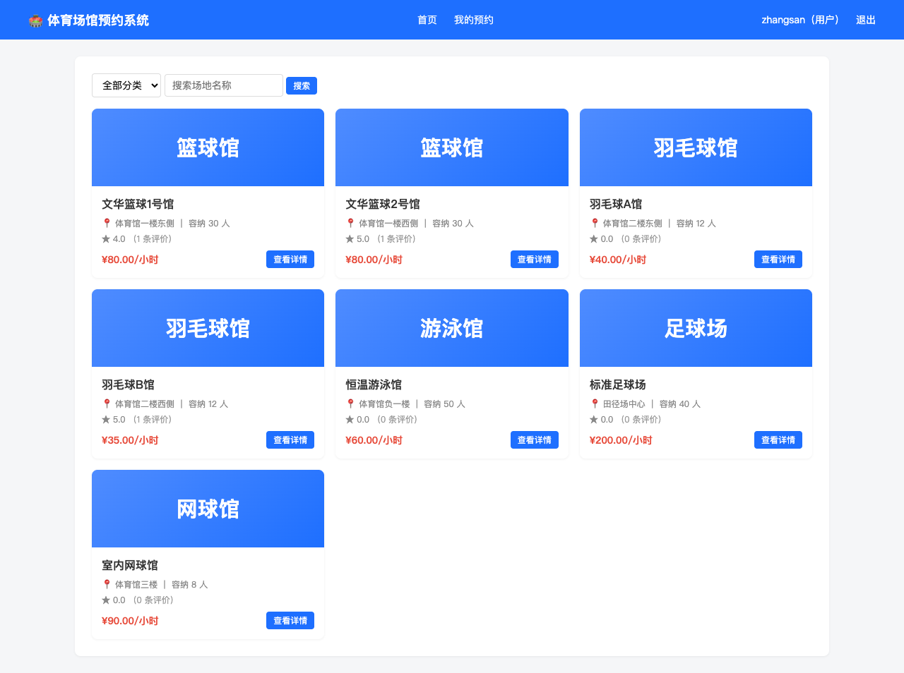
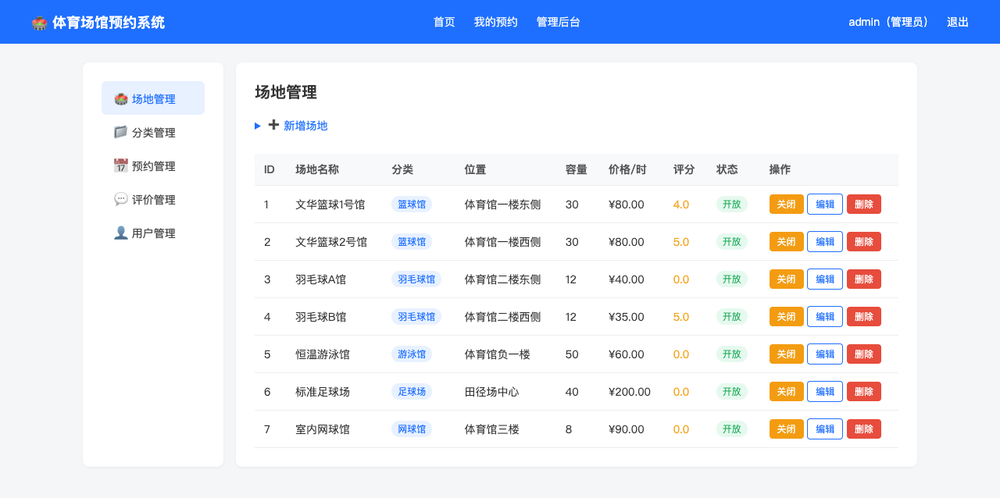
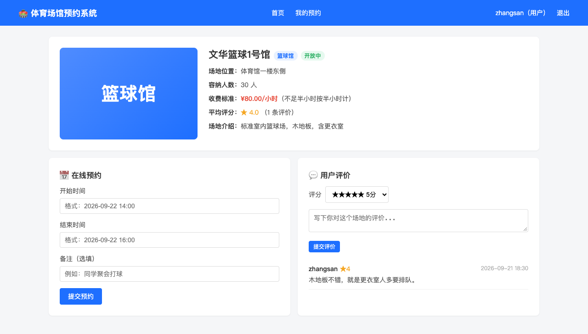
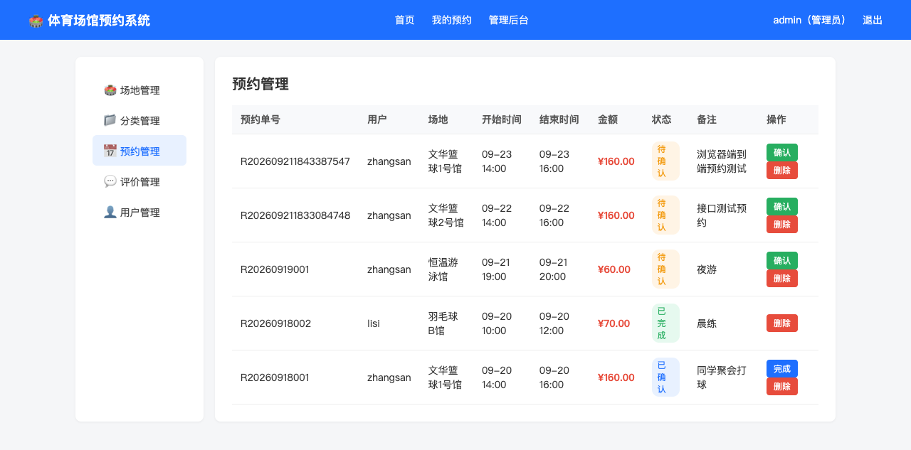
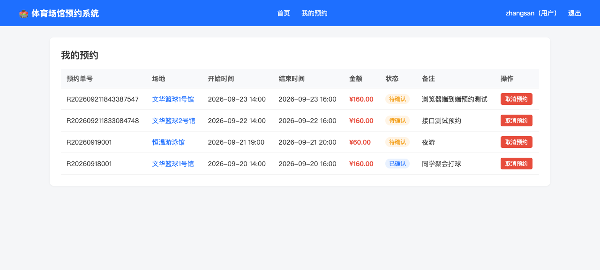
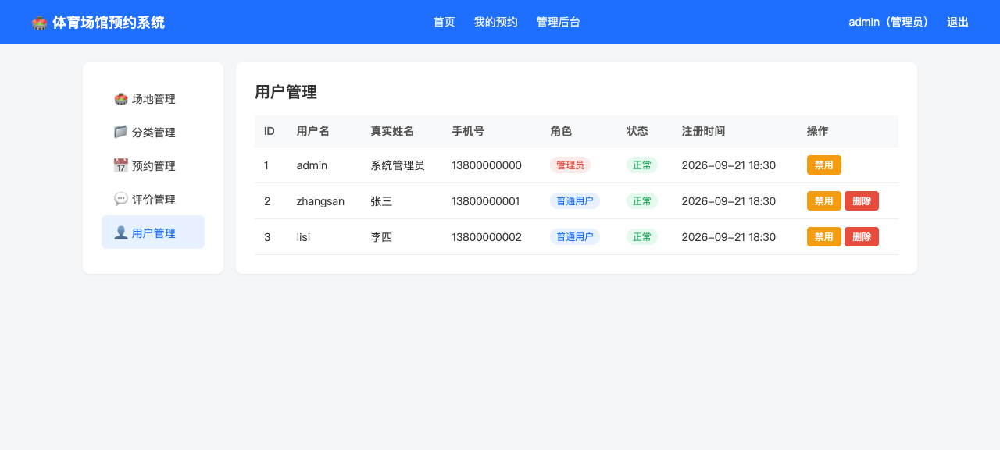

# 体育场馆预约系统（SSM + JSP）

[](https://github.com/WcuMe/ssm-venue-reservation/actions/workflows/maven-ci.yml)


基于 **Spring + SpringMVC + MyBatis** 三大框架开发的体育场馆预约系统，面向高校体育场馆的日常开放管理场景，实现**用户管理、场地管理、预约管理、分类管理、评价管理**五大功能模块。

> 《SSM框架开发技术项目实战》课程考查大作业 · 2026～2027 学年度第一学期

---

## 一、技术栈

| 层级 | 技术 | 版本 |
|---|---|---|
| 表现层 | JSP + JSTL + 原生 CSS | Servlet 3.1 |
| 控制层 | SpringMVC（DispatcherServlet） | 5.3.39 |
| 业务层 | Spring IoC / 声明式事务 | 5.3.39 |
| 持久层 | MyBatis + Mapper XML | 3.5.16 |
| 连接池 | Alibaba Druid | 1.2.23 |
| 数据库 | MySQL | 8.0 / 9.x |
| 测试 | JUnit4 + Spring Test | 4.13.2 |
| 构建 | Maven | war 包 |
| 运行 | Jetty Maven Plugin | 9.4.54 |

**为什么用 Jetty 而不是 Tomcat7**：详见 [踩坑记录](#七踩坑记录tomcat7-与-spring-53-的兼容性)。

---

## 二、五大功能模块

| 模块 | 功能说明 |
|---|---|
| **用户管理** | 注册 / 登录、MD5 无关明文校验、Session 会话、**普通用户 / 管理员双角色**、账号禁用与启用、逻辑删除 |
| **场地管理** | 场地 CRUD、开放 / 关闭状态切换、按分类筛选、关键词模糊搜索、图片与单价管理 |
| **预约管理** | 在线提交预约、**时间段冲突校验**、**费用自动计算（不足半小时按半小时计）**、状态流转（待确认 → 已确认 → 已完成 / 已取消）、取消预约 |
| **分类管理** | 分类 CRUD、**关联完整性校验（分类下有场地时禁止删除）** |
| **评价管理** | 1~5 星评分 + 文字评论、**场地平均评分自动回流统计**、违规评价删除 |

---

## 三、数据库设计

5 张数据表，字符集 `utf8mb4`，通过外键保证参照完整性。建表脚本见 [`sql/init.sql`](sql/init.sql)。

| 表名 | 说明 | 关键字段 |
|---|---|---|
| `user` | 用户表 | username(唯一)、password、role(USER/ADMIN)、status |
| `category` | 场地分类表 | name(唯一)、sort |
| `venue` | 场地表 | name、category_id(外键)、price_per_hour、status、avg_rating、review_count |
| `reservation` | 预约表 | user_id、venue_id(双外键)、start_time、end_time、status、total_price |
| `review` | 评价表 | user_id、venue_id(双外键)、rating(1-5)、content |

预约表与评价表构成 **user ↔ venue 的多对多关系**，E-R 图与类图见 [`docs/`](docs/) 目录下的 `fig2-er.png`、`fig3-class.png`。

---

## 四、快速开始

### 环境要求

- JDK 8+
- Maven 3.6+
- MySQL 8.0+

### 1. 初始化数据库

```bash
# ⚠️ 必须指定 utf8mb4，否则中文会双重编码乱码
mysql -uroot -p --default-character-set=utf8mb4 < sql/init.sql
```

脚本会创建 `venue_reservation` 库并写入测试数据（3 个用户、6 个分类、7 个场地）。

### 2. 修改数据库连接

编辑 `src/main/resources/jdbc.properties`：

```properties
jdbc.url=jdbc:mysql://localhost:3306/venue_reservation?useUnicode=true&characterEncoding=utf8&useSSL=false&serverTimezone=Asia/Shanghai&allowPublicKeyRetrieval=true
jdbc.username=root
jdbc.password=123456
```

### 3. 启动

```bash
mvn jetty:run
```

浏览器打开 <http://localhost:8080>

### 4. 测试账号

| 角色 | 账号 | 密码 |
|---|---|---|
| 管理员 | `admin` | `123456` |
| 普通用户 | `zhangsan` | `123456` |
| 普通用户 | `lisi` | `123456` |

### 5. 打包部署

```bash
mvn clean package     # 生成 target/venue-reservation.war
```

war 包可直接丢进任意 Servlet 3.1+ 容器（Tomcat 9 / Jetty）的 `webapps` 目录。

---

## 五、项目结构

```
venue-reservation/
├── pom.xml                          # Maven 依赖与插件配置
├── sql/
│   └── init.sql                     # 建库 + 建表 + 测试数据
├── src/
│   ├── main/
│   │   ├── java/com/wenhua/venue/
│   │   │   ├── entity/              # 5 个实体类（User/Category/Venue/Reservation/Review）
│   │   │   ├── mapper/              # 5 个 Mapper 接口（MyBatis）
│   │   │   ├── service/             # 5 个 Service 接口 + impl 实现
│   │   │   ├── controller/          # 6 个 Controller（含 PageController）
│   │   │   ├── interceptor/         # LoginInterceptor 登录与权限拦截
│   │   │   └── utils/               # Result 统一响应
│   │   ├── resources/
│   │   │   ├── mapper/              # 5 个 Mapper XML（动态 SQL）
│   │   │   ├── spring/              # applicationContext.xml + spring-mvc.xml
│   │   │   ├── jdbc.properties
│   │   │   └── mybatis-config.xml
│   │   └── webapp/
│   │       ├── WEB-INF/
│   │       │   ├── views/           # 14 个 JSP 页面（前台 + admin 后台）
│   │       │   └── web.xml          # DispatcherServlet / 编码过滤器
│   │       └── static/css/style.css
│   └── test/java/                   # 3 个测试类，27 个 @Test
├── docs/                            # 报告插图 + 报告正文
├── screenshots/                     # 系统运行截图（11 张）
└── README.md
```

**代码规模**：Java 31 个文件 / 约 1570 行，JSP 14 个，XML 9 个。

---

## 六、单元测试

```bash
mvn test
```

```
Tests run: 27, Failures: 0, Errors: 0, Skipped: 0
BUILD SUCCESS
```

覆盖范围：

| 测试类 | 覆盖内容 |
|---|---|
| `UserServiceTest` | 登录成功/密码错误/账号禁用、注册重复校验、角色权限 |
| `ReservationServiceTest` | **预约时间冲突校验**、费用计算（半小时进位）、状态流转、取消 |
| `VenueModuleTest` | 场地 CRUD、分类删除约束、评价提交与平均分回流统计 |

---

## 七、踩坑记录：Tomcat7 与 Spring 5.3 的兼容性

本地开发时用 `tomcat7-maven-plugin` 启动，页面能正常渲染但 **CSS 静态资源全部 404**。

根因：
- Tomcat 7 只支持 **Servlet 3.0**
- Spring 5.3 的 `ResourceHttpRequestHandler` 调用了 Servlet 3.1 才有的 `setContentLengthLong()` 方法
- 结果：SpringMVC 处理静态资源时抛 `NoSuchMethodError`

解决方案：改用 **Jetty 9.4**（支持 Servlet 3.1，且与 JDK 8 完全兼容）。这也是传统 SSM 项目在容器选型上值得注意的一点 —— **框架版本与容器规范版本要对齐**。

> 另一个坑：MySQL 导入中文 SQL 脚本时必须加 `--default-character-set=utf8mb4`，否则中文字段会被**双重编码**，读取出来是 `å¼ ä¸‰` 这样的乱码。

---

## 八、界面预览

| 前台 | 后台 |
|---|---|
|  |  |
|  |  |
|  |  |

全部 11 张截图见 [`screenshots/`](screenshots/)。

---

## 九、开发工作流

完整的项目构建流程（从读题到交付报告）记录在 **[`docs/WORKFLOW.md`](docs/WORKFLOW.md)**，包含：

- 需求拆解与选题决策
- 数据库建模 → 编码 → 测试 → 截图的完整流水线
- 报告图件的 SVG 绘制流程
- 报告自动排版流水线（Markdown → docx）
- 环境搭建命令清单

---

## 十、License

MIT License. 详见 [LICENSE](LICENSE)。
